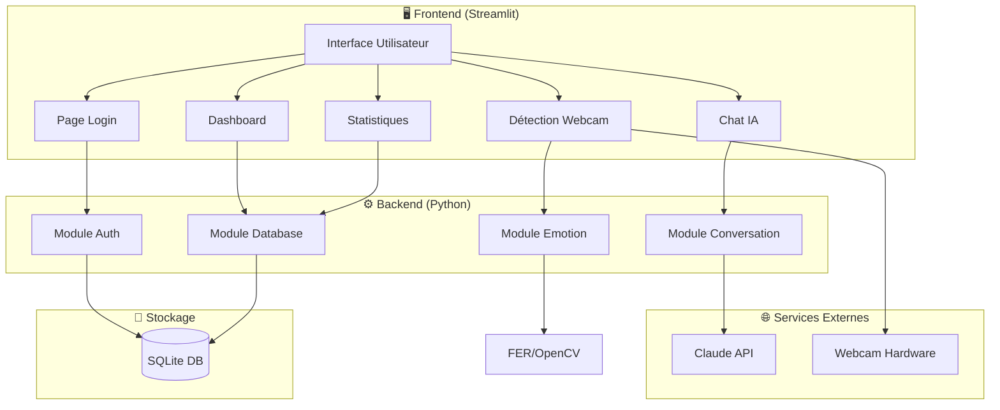

# 🏗 Architecture Technique - Emotion AI

## Vue d'ensemble

L'application Emotion AI suit une architecture modulaire en couches, facilitant la maintenance et l'évolution.

## Diagramme d'architecture



## Modules

### 1. Module Authentication (`auth/`)

**Responsabilités :**
- Gestion des mots de passe (hachage, vérification)
- Création et validation des tokens JWT
- Validation des données utilisateur

**Technologies :**
- `bcrypt` : Hachage sécurisé des mots de passe
- `PyJWT` : Tokens d'authentification

**Flux d'authentification :**

```
┌──────────┐     ┌──────────┐     ┌──────────┐
│  Client  │────>│  bcrypt  │────>│  SQLite  │
│          │     │  hash    │     │  (users) │
└──────────┘     └──────────┘     └──────────┘
     │                                  │
     │           ┌──────────┐          │
     └──────────>│   JWT    │<─────────┘
                 │  token   │
                 └──────────┘
```

### 2. Module Database (`database/`)

**Responsabilités :**
- Définition des modèles de données
- Opérations CRUD
- Statistiques et agrégations

**Modèles :**

| Modèle | Description |
|--------|-------------|
| `User` | Compte utilisateur avec auth |
| `EmotionRecord` | Historique des émotions |
| `Conversation` | Messages du chat |

**Relations :**
- User 1:N EmotionRecord
- User 1:N Conversation

### 3. Module Emotion Detection (`emotion_detection/`)

**Responsabilités :**
- Capture et traitement des frames webcam
- Détection faciale
- Classification des émotions
- Analyse des tendances

**Pipeline de détection :**

```
┌─────────┐    ┌─────────┐    ┌─────────┐    ┌─────────┐
│ Webcam  │───>│ OpenCV  │───>│  FER    │───>│ Result  │
│ Frame   │    │ BGR→RGB │    │  CNN    │    │ Emotion │
└─────────┘    └─────────┘    └─────────┘    └─────────┘
                                   │
                                   ▼
                            ┌─────────┐
                            │Analyzer │
                            │ Pattern │
                            └─────────┘
```

**Classes principales :**

- `EmotionDetector` : Détection via FER
- `EmotionResult` : Résultat structuré
- `EmotionAnalyzer` : Analyse des patterns

### 4. Module Conversation Engine (`conversation_engine/`)

**Responsabilités :**
- Intégration avec l'API Claude
- Gestion du contexte émotionnel
- Génération de réponses empathiques
- Conseils bien-être

**Flux de conversation :**

```
┌─────────────┐
│ User Input  │
└──────┬──────┘
       │
       ▼
┌─────────────┐     ┌─────────────┐
│  Emotion    │────>│   System    │
│  Context    │     │   Prompt    │
└─────────────┘     └──────┬──────┘
                          │
                          ▼
                   ┌─────────────┐
                   │ Claude API  │
                   └──────┬──────┘
                          │
                          ▼
                   ┌─────────────┐
                   │  Response   │
                   └─────────────┘
```

## Sécurité

### Couches de sécurité

```
┌────────────────────────────────────┐
│         Application Layer          │
│  • Input validation                │
│  • Session management              │
└────────────────────────────────────┘
                  │
┌────────────────────────────────────┐
│         Authentication             │
│  • bcrypt password hashing         │
│  • JWT tokens (24h expiry)         │
└────────────────────────────────────┘
                  │
┌────────────────────────────────────┐
│         Data Protection            │
│  • User data isolation             │
│  • Consent-based webcam access     │
└────────────────────────────────────┘
                  │
┌────────────────────────────────────┐
│         Storage Security           │
│  • Local SQLite (no cloud)         │
│  • Environment variables           │
└────────────────────────────────────┘
```

## Performance

### Optimisations

| Composant | Optimisation |
|-----------|--------------|
| Détection | Traitement toutes les 5 frames |
| Base de données | Sauvegarde toutes les 30 frames |
| Historique chat | Limite à 10 messages pour API |
| Session | Variables en mémoire |

### Ressources

| Métrique | Valeur approximative |
|----------|---------------------|
| RAM | ~500MB (avec modèle FER) |
| CPU | Modéré (webcam + détection) |
| Disque | ~100MB (DB + modèle) |

## Extensibilité

### Points d'extension

1. **Nouveaux détecteurs d'émotions**
   - Implémenter l'interface `detect_emotion(frame)`
   
2. **Autres LLMs**
   - Modifier `ConversationEngine` pour OpenAI, etc.

3. **Stockage externe**
   - Changer `DATABASE_URL` pour PostgreSQL

4. **Nouvelles émotions**
   - Ajouter dans `EMOTION_TRANSLATIONS`

## Déploiement

### Local (développement)

```bash
streamlit run app.py
```

### Production (recommandé)

```bash
# Avec gunicorn et nginx
gunicorn -w 4 -k uvicorn.workers.UvicornWorker app:app

# Ou avec Docker
docker-compose up -d
```

### Variables d'environnement requises

```
ANTHROPIC_API_KEY=sk-ant-...
JWT_SECRET_KEY=<random-32-chars>
DATABASE_URL=sqlite:///emotion_ai.db
```
